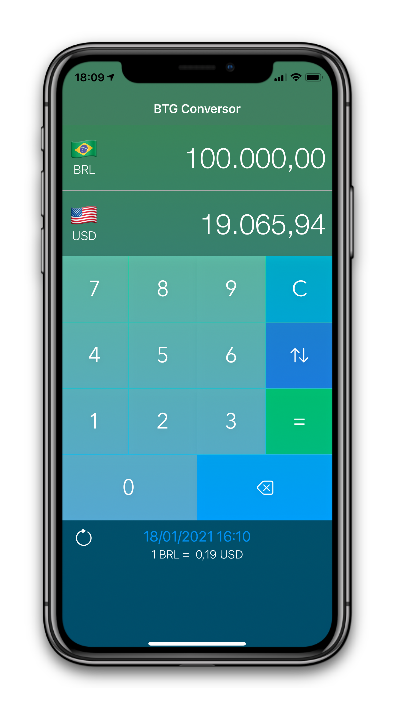
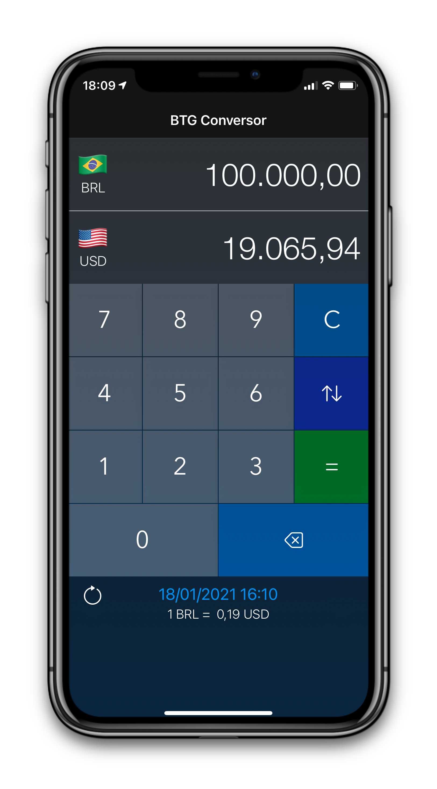
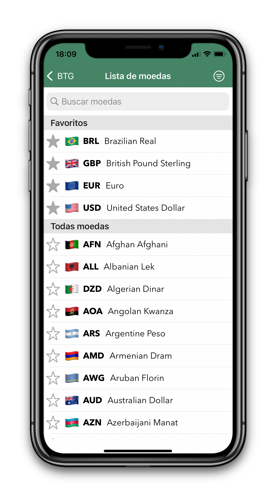
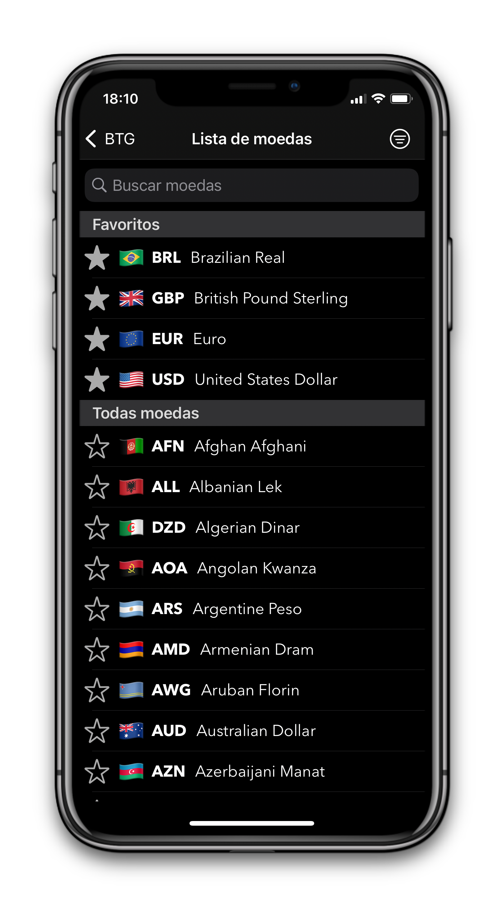
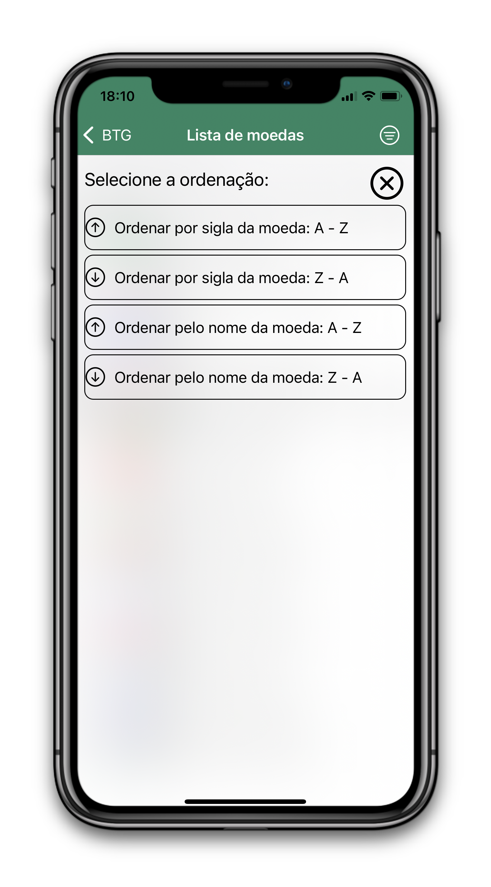
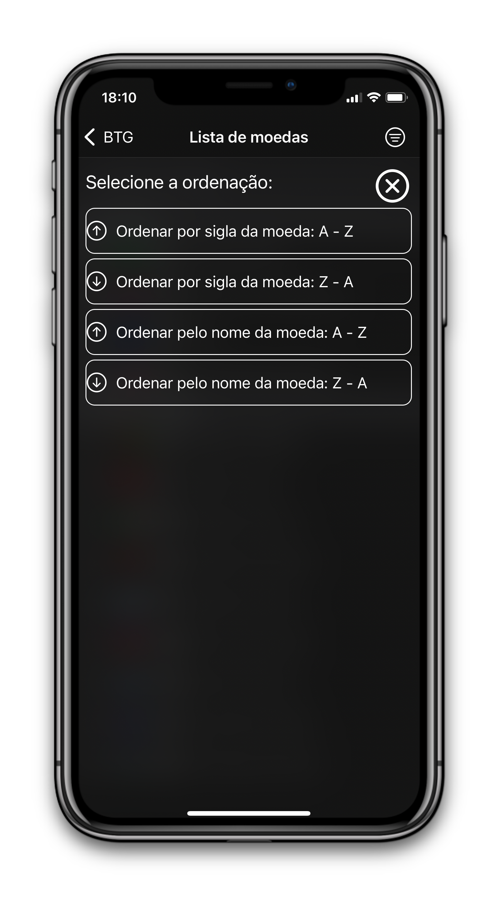

# Desafio BTG

#### Autor: Guilherme Kauffmann

## Objetivo:

O Desafio consiste no desenvolvimento de um app de conversão de moedas. O app deve permitir que o usuário selecione a moeda de origem e a moeda a ser convertida, para então inserir o valor e visualizar o resultado da conversão.

## Requisitos:

O app deve counsumir a **API CurrencyLayer**. Para utilizar a API será necessário fazer um cadastro no plano gratuito para obter uma chave de acesso. Como o plano gratuito da API apresenta apenas as taxas de câmbio em relação ao dólar americano (USD), caso o usuário deseje fazer uma conversão entre quaisquer outras duas moedas, será necessário primeiro converter a moeda de origem para dólar e então de dólar para a moeda desejada.

* Linguagem do aplicativo - iOS: Swift

* O aplicativo deve ter duas telas principais:

	* A tela de conversão deve conter:
		* Dois botões que permitam o usuário a escolher as moedas de origem e de destino.
		* Um campo de entrada de texto onde o usuário possa inserir o valor a ser convertido.
		* Uma campo de texto para apresentar o valor convertido.
	* A tela de listagem de moedas deve conter:
		* Uma lista das moedas disponíves para conversão, mostrando código e nome da moeda.
* A listagem de moedas deve ser mostrada obrigatóriamente em uma tela diferente da tela de conversão.

## Observações:

* Evite utilizar bibliotecas externas ao máximo possível.
* Caso opte por usar bibliotecas externas, prefira o CocoaPods como gerenciador de
dependências.
* O objetivo deste desafio é avaliar o seu conhecimento técnico, estilo de código, conhecimento de arquiteturas, padrões de programação e boas práticas. Faça disso uma oportunidade para mostrar todo o seu conhecimento. Além disso, suas escolhas de UI/UX também serão levadas em consideração. Com isso vamos avaliar a sua capacidade de entregar um bom produto nas mãos dos nossos clientes.

# Features
### Obrigatórias:

* As taxas de câmbio disponíveis devem ser obtidas da chamada de API Supported Currencies (**/list**).
* A cotação atual deve ser obtida da chamada de API Real-time Rates (**/live**).
* É necessário fazer tratamento de erros e dos fluxos de exceção, como busca vazia, carregamento e outros erros que possam ocorrer.

### Opcionais (não necessário, porém contam pontos):

* Funcionalidade de busca na lista de moedas por nome ou sigla da moeda ("dólar" ou "USD").
* Ordenação da lista de moedas por nome ou código.
* Realizar a persistência local da lista de moedas e taxas para permitir o uso do app no caso de falta de internet.
* Adicionar a capacidade de favoritar uma moeda para que ela sempre apareça no topo da lista.
* Desenvolver testes unitários e/ou funcionais.
* Desenvolver o app seguindo a arquitetura MVVM.


## Telas

* Tela de conversão do app (Modo claro e Modo Escuro):
  * Recupera a cotação atual para conversão da moeda.
  * Dois botões que permitam o usuário a escolher as moedas de origem e de destino.
  * Um campo de entrada de texto onde o usuário possa inserir o valor a ser convertido.
  * Uma campo de texto para apresentar o valor convertido.
  * Apresenta a data da última atualização das moedas.
  * Botão para fazer uma troca entre a moeda de origem e a de destino.
  * Botão para atualizar a cotação.
  * Texto com a equivalência de 1 moeda de origem para a de destino.
  * Teclado de fácil digitação.

 


* Tela de listagem de moedas (Modo claro e Modo Escuro):
  * Uma lista das moedas disponíves para conversão, mostrando código, nome da moeda, bandeira da moeda e um botão para favoritar a moeda.
  * Uma lista com as moedas favoritas.
  * Uma barra de busca na lista de moedas por nome ou sigla da moeda ("dólar" ou "USD").
  * Um botão para ordenação da lista de moedas por nome ou código.




* Tela de listagem das moedas com opção para organizar a lista (Modo claro e Modo Escuro):
  * Um botão para ordenação da lista de moedas por nome A - Z.
  * Um botão para ordenação da lista de moedas por nome Z - A.
  * Um botão para ordenação da lista de moedas por sigla A - Z.
  * Um botão para ordenação da lista de moedas por sigla Z - A.

 


## Testes unitários:

* Testa a inicialização de uma instância de **ConverterViewModel** e verifique se está recuperando a cotação atual ou se está salva localmente.

```swift
func testConverterViewModel() {
  let converterViewModel = ConverterViewModel()
  let converterExpectation = expectation(description: "Cotação atual das moedas")
  converterViewModel.bindCurrencyViewModelToController = {
    if converterViewModel.currencyValueModel == nil {
      XCTFail("Falha na recuperação da cotação das moedas")
    } else {
      converterExpectation.fulfill()
    }
  }

  waitForExpectations(timeout: 10) { (error) in
     XCTAssertNotNil(converterViewModel.currencyValueModel)
  }
}
```


* Testa a inicialização de uma instância de **CurrencyListViewModel** e verifique se está recuperando a lista de moedas disponíveis ou se está salva localmente.

```swift
func testCurrencyListViewModel() {
  let currencyListViewModel = CurrencyListViewModel()
  let converterExpectation = expectation(description: "Lista de moedas disponíveis")
  currencyListViewModel.bindCurrencyListViewModelToController.bind { (_) in
    if currencyListViewModel.listCurrency.count == 0 {
       XCTFail("Falha na recuperação da lista de moedas")
    } else {
       converterExpectation.fulfill()
    }
  }

  waitForExpectations(timeout: 10) { (error) in
     XCTAssertNotNil(currencyListViewModel.listCurrency)
  }
}
```


* Verifique se está calculando o valor de conversão de moeda esperado para a cotação atual.

```swift
func testCalculateCurrencyValue() {
  let converterViewModel = ConverterViewModel()
  let converterExpectation = expectation(description: "Calcular cotação atual")
  let valueCalculate: Double = 35.5

  converterViewModel.bindCurrencyViewModelToController = {
    if converterViewModel.currencyValueModel == nil {
      XCTFail("Falha na recuperação da cotação das moedas")
    } else {
      let currencySource = converterViewModel.currencyModelSource!
      let currencyDestiny = converterViewModel.currencyModelDestiny!

      var currencySourceValue: Double = 0
      var currencyDestinyValue: Double = 0
      for currency in converterViewModel.currencyValueModel!.quotes! {
        if currency.key == converterViewModel.currencyValueModel!.source!  + currencySource.currencyCode {
          currencySourceValue = currency.value
        }

        if currency.key == converterViewModel.currencyValueModel!.source! + currencyDestiny.currencyCode {
          currencyDestinyValue = currency.value
        }
      }

      let valueCalculeted = (currencyDestinyValue/currencySourceValue) * valueCalculate
      let valueCalculetedText = Money.currencyFormatter(value: valueCalculeted)

      converterViewModel.calculateCurrencyValue(value: valueCalculate) {
        XCTAssertEqual(converterViewModel.currencyModelDestiny!.currencyValue, valueCalculetedText, "Os valores calculados deram diferentes")
        converterExpectation.fulfill()
      }
    }
  }

  waitForExpectations(timeout: 10) { (error) in
     XCTAssertNotNil(converterViewModel.currencyModelDestiny!.currencyValue)
  }
}
```


* Testa a recuperação da cotação da moeda atual usando a API.

```swift
func testRetrieveCurrencyLive() {
  let apiService = APIService()
  let currencyExpectation = expectation(description: "Recuperar a cotação atual das moedas")
  var currencyValue: CurrencyValueModel!
  apiService.getCurrencyLive { (result) in
      switch result {
         case .success(let list):
              let currencyValueModel = (list as! CurrencyValueModel)
              if currencyValueModel.success! == true {
                 currencyValue = currencyValueModel
                 currencyExpectation.fulfill()
              } else {
                 XCTFail(currencyValueModel.error!.info!)
              }
              break
         case .failure(let error):
              XCTFail("Não foi possível recuperar a cotação atual " + error.localizedDescription)
              break
      }
  }

  waitForExpectations(timeout: 10) { (error) in
     XCTAssertNotNil(currencyValue)
  }
}
```


* Testa a recuperação da lista de moedas disponíveis por meio da API.

```swift
func testRetrieveCurrencyList() {
  let apiService = APIService()
  let currencyExpectation = expectation(description: "Recuperar a lista de moedas disponíveis")
  var currencyList: CurrencyListModel!
  apiService.getCurrencyList { (result) in
       switch result {
              case .success(let list):
                   let currencyListModel = (list as! CurrencyListModel)
                   if currencyListModel.success! == true {
                      currencyList = currencyListModel
                      currencyExpectation.fulfill()
                   } else {
                      XCTFail(currencyListModel.error!.info!)
                   }
                   break
              case .failure(let error):
                   XCTFail("Não foi possível recuperar a lista de moedas " + error.localizedDescription)
                   break
       }
  }

  waitForExpectations(timeout: 10) { (error) in
     XCTAssertNotNil(currencyList)
  }
}
```

